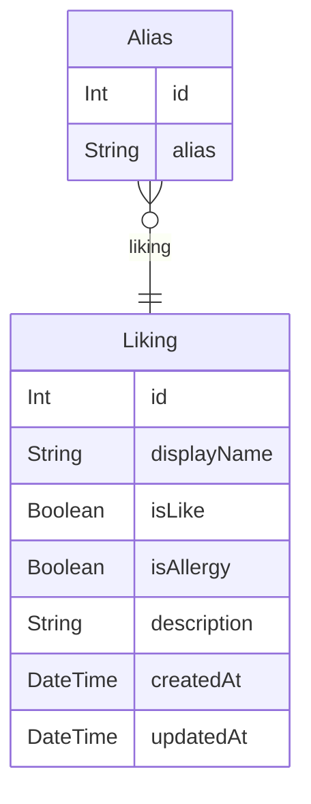

# can i give u

## これなに

食の好みやアレルギーの管理を行うアプリケーション

## 機能

- ユーザ認証
- 好み、アレルギー情報の登録
- 食べ物情報の検索
- 食べ物情報の削除
- エイリアスの登録、検索

## デプロイ手順

### `.env`の設定

| 項目                                         | 内容                                      |
| -------------------------------------------- | ----------------------------------------- |
| `NEXT_PUBLIC_AMPLIFY_USERPOOL_ID`            | Amazon Cognito の User pool ID            |
| `NEXT_PUBLIC_AMPLIFY_USERPOOL_WEB_CLIENT_ID` | Amazon Cognito の App client の Client ID |
| `DATABASE_URL`                               | 使用するデータベースの接続先              |

### `prisma/schema.prisma`の設定

`provider`など使用するデータベースに合った設定を行う

### 実行

```bash
npx prisma db push
# 必要に応じて
npx prisma db seed
npm run start
```

### ローカル環境での実行(開発環境)

```bash
# SQLiteのローカルDBを利用
npm run setup:dev
npm run start
```

## 利用した主なもの

### 実装

| 名称        | 用途                |
| ----------- | ------------------- |
| Next.js     | フロントエンド, API |
| Prisma      | データベース操作    |
| MUI         | UI コンポーネント   |
| AWS Amplify | 認証コンポーネント  |

### デプロイ

| 名称        | 用途         |
| ----------- | ------------ |
| Vercel      | デプロイ環境 |
| PlanetScale | データベース |
| AWS Cognito | ユーザ認証   |

## ER 図



## TODO

- テスト
- 概要などの更新
- 画面デザイン(エイリアス, ログアウト, リスト部分など)
